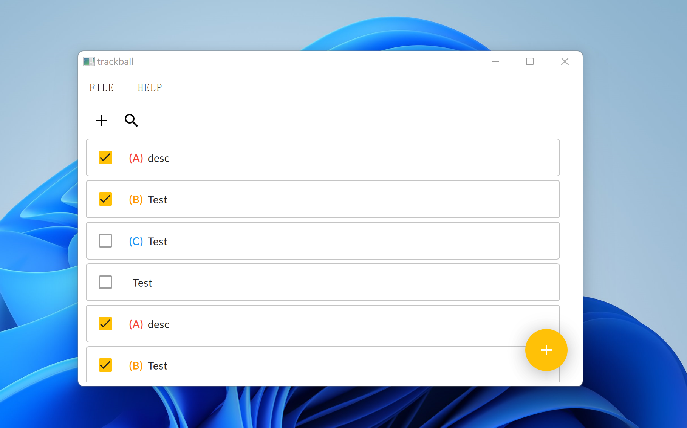

# 🖲️ `Project Trackball`

  

###### Announcement

- **🚧🏗️ WIP & Welcome: Currently `Project Trackball` is ~~slowly~~ developing. We are waiting for you to join [Nothing Else Lab](https://github.com/NthElse) to develop this project and [more](https://github.com/orgs/NthElse/projects/1)!**
- 🎆 `Project Trackball`'s official name and logo have not yet been decided, so feel free to submit your ideas!

------

A [todo.txt](http://todotxt.org/) desktop app. Written in C++ & Qt Quick.

## Features

- Material Design ~~(Only UI elements)~~
- Fast
- Small

## Dependencies

- Qt 5
- [Qaterial](https://github.com/OlivierLDff/Qaterial)

------

Made by [Nothing Else Lab](https://github.com/NthElse) with 🦄.

无他。

